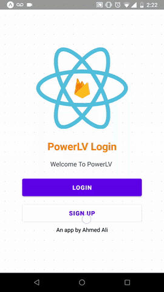

# PowerLV
#### This app is currently still in development.

The purpose of this app is to track the fitness progress of a user and compare current progress with friends.
PowerLV uses `React Native` as a frontend solution in conjunction with `Google Firebase` as a backend. 

## Features
The app features full CRUD operations regarding the management of users. Users can also request to have 
their password changed if they forget their credentials via their provided email. Authenticated user accounts are also directly
connected to `Firestore` (database within Firebase), creating a smoother development/user experience. The Power Tracker graph
queries firestore for previous power level entries.

## Notable Technologies Used 
expo, react-navigation, react-native-svg-charts, Firebase, Firebase/Auth, Firestore,  mobx.
## Instructions
from root in command line run:
(if you dont already have expo installed)
```
  npm install -g expo-cli
  npm install && npm run start
  for quickest demo download the expo app for ios and run and scan the QR code with your iphone camera
```
# Screens
<p float="left">


</p>  

# Demo to date



